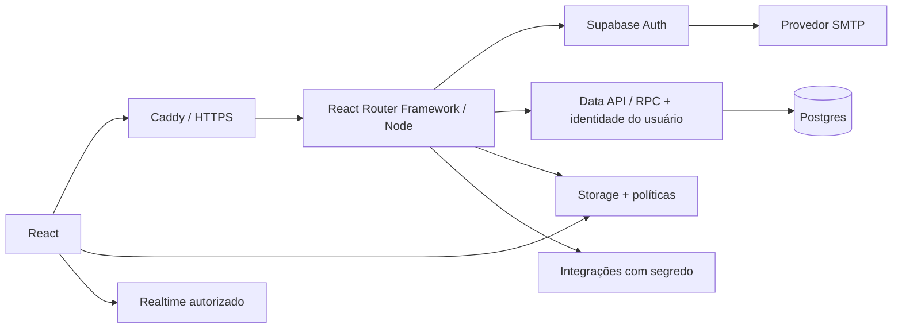

# Backend, dados e autenticação

Detalhamento do MVP conforme a [arquitetura aprovada em 22/09/2026](../specs/architecture-mvp.md). O modelo relacional abaixo continua proposto e ainda não foi aplicado. O projeto `CircuitoNE-dev` não tinha tabelas em `public` nem migrações na inspeção. Produção não foi modificada.

## Componentes

Postgres é a fonte da verdade. React mantém estado de formulário e cache de leitura, sem replicar decisões de autorização. Interfaces públicas recebem somente projeções públicas; ocultar um campo no JSX não o protege.

Usar o SDK Supabase com tipos gerados. Preferir módulos pequenos por caso de uso (perfis, coletivos, eventos, mensagens), sem repositório genérico, fábrica de serviços ou abstração para múltiplos bancos. Só adicionar biblioteca de cache quando a primeira integração mostrar necessidade; não converter o projeto inteiro antecipadamente.

O Node atende SSR, loaders/actions, validação com Zod e integrações que exigem segredo. Acesso comum ao Supabase preserva a identidade do usuário e RLS; não usa `service_role`. Invariantes atômicas ficam no Postgres/RPC. Edge Functions só entram quando houver necessidade de execução independente, sem duplicar regras. Páginas públicas entregam conteúdo/metadados no HTML inicial; respostas autenticadas não entram em cache compartilhado.

## Modelo relacional proposto

UUIDs em entidades, `timestamptz` para instantes, `date` para nascimento, `created_at`/`updated_at` nas entidades mutáveis. FKs indexadas quando usadas em políticas e consultas. Valores monetários em centavos inteiros, nunca texto formatado.

| Tabela / esquema lógico | Campos principais | Relações e restrições |
|---|---|---|
| `auth.users` | identidade, e-mail, credenciais gerenciadas por Auth | Não duplicar senha. E-mail de login tem Auth como fonte. |
| `private.account_details` | `user_id`, nome, CPF normalizado, nascimento, gênero, cidade, UF, estado da conta | PK/FK `user_id`; CPF `NOT NULL UNIQUE`, 11 dígitos + verificação; nascimento obrigatório. Sem acesso público ou de administradores de coletivos. |
| `profiles` | id, `owner_id`, tipo de atuação, nome, redes | Conta 1:N atuações; sem unicidade por proprietário para artista. Tipo entre artista/serviços/audiovisual/integrante. Proprietário imutável via cliente. |
| `artist_profiles` | `profile_id`, bio, estilos, cor, foto, status público | 1:1 atuação artista; leitura pública apenas de perfil publicado. Não contém contatos profissionais/CPF. |
| `professional_details` | `profile_id`, booking, contato, presskit URL, `fee_cents`, CNPJ, tipo serviço, portfólio | 1:1 perfil profissional; titular mantém, administradores habilitados consultam. `fee_cents >= 0`; tipo coerente com atuação. CNPJ fica privado. |
| `profile_images` | id, `profile_id`, caminho Storage, ordem, texto alternativo | 1:N; índice `(profile_id, position)`; limite por perfil definido na fase 2. |
| `collectives` | id, nome, tipo, bio, cidade/UF, atuação, cor, imagem, redes, estado | Dados públicos; conta criadora não é fonte exclusiva de autorização. |
| `private.collective_reviews` | coletivo, decisão, motivo, decisor, data | Histórico de verificação editorial; somente administração do site decide. Criador recebe somente o estado/motivo apropriado da própria solicitação. |
| `private.site_admins` | `user_id`, concedido por/em | Papel operacional separado de N2; provisionado por procedimento administrativo controlado. Cliente não se promove nem altera a lista. |
| `private.collective_details` | `collective_id`, CNPJ | 1:1; criação/alteração de produtora exige CNPJ na mesma transação. Não embutir CNPJ em resposta pública. |
| `collective_roles` | id, `collective_id`, nome, nível | `CHECK level IN (0,1,2)`; único `(collective_id, name)`; chave `(collective_id,id)` referenciável. |
| `collective_memberships` | `collective_id`, `user_id`, `role_id`, `artist_profile_id`, entrada, última atividade | PK `(collective_id,user_id)`; FK composta `(collective_id,role_id)` impede cargo de outro coletivo. Perfil vinculado pertence ao membro. |
| `membership_requests` | id, coletivo, usuário, atuação desejada, mensagem, status, decisão/decisor/data | Índice único parcial `(collective_id,user_id)` onde status pendente. Estados pendente/aprovada/recusada/cancelada; histórico não é apagado ao decidir. |
| `events` | id, coletivo, nome, tipo/outro, Markdown, início, fim opcional, fuso, local, gratuito/link, capa, status | `ends_at IS NULL OR ends_at > starts_at`; ingresso gratuito XOR link; tipo outros exige texto. Status depende de D-05. |
| `event_lineup` | id, evento, artista opcional, nome exibido, ordem | Evento 1:N; FK artista; texto obrigatório para nome livre; único `(event_id,artist_profile_id)` quando não nulo. |
| `conversations` | id, tipo pessoal/coletivo, coletivo opcional, criado por, estado | Tipo coletivo exige coletivo; modelo de destinatário externo aguarda D-06. |
| `conversation_participants` | conversa, usuário, última mensagem lida/data | PK composta. Conversas pessoais autorizadas por participação. Não conceder a membro N0 uma conversa coletiva por mero registro nesta tabela. |
| `messages` | id, conversa, autor, conteúdo, criado em, `client_message_id`, representação opcional | Autor da sessão; único `(author_id,client_message_id)` para retry; limite de tamanho; mensagens não reescritas livremente. |
| `private.audit_events` | ator, ação, recurso, instante, resultado, referência de correlação | Somente append pelo servidor; não registrar corpo de chat, CPF, senha, token ou dados completos de formulário. |

O esquema `private` não será exposto pela Data API. A leitura/edição dos próprios dados de conta passa por operações específicas com autorização explícita. Caso se use view pública, `security_invoker=true`; não criar view que junte dados privados para depois “filtrar no frontend”.

`professional_details` pode permanecer em esquema exposto com RLS estrita, pois é separado dos dados de identidade. Uma `SELECT` de `artist_profiles` nunca inclui implicitamente essa tabela. JSONB é aceitável para redes sociais opcionais; não usar JSONB para membros, mensagens, permissões ou valores de negócio que exigem integridade relacional.

## Matriz de acesso proposta

| Recurso / operação | Anônimo | Titular / participante | N0 do coletivo | N1 | N2 do coletivo |
|---|---|---|---|---|---|
| Artistas/coletivos/eventos publicados, leitura | Sim | Sim | Sim | Sim | Sim |
| CPF, nascimento e dados de conta | Não | Apenas os próprios | Não | Não | Não |
| Editar perfil pessoal/profissional | Não | Apenas o próprio | Não | Não | Não, salvo ser titular |
| Ler contatos/presskit/cachê | Não | Próprios | Não | Não | Sim, diretório conforme RN-07/D-01 |
| Dashboard interno do coletivo | Não | Só se membro | Sim | Sim | Sim |
| Chat pessoal | Não | Só participantes autorizados | Sem privilégio extra | Sem privilégio extra | Sem privilégio extra |
| Chat do coletivo | Não | Depende do cargo atual | Não | Sim | Sim |
| Gerir coletivo, cargos, solicitações e eventos | Não | Depende do cargo atual | Não | Não | Apenas o próprio coletivo |

Administrar A jamais autoriza editar B. O diretório profissional é a exceção de leitura global já confirmada, não uma permissão administrativa global. CPF e nascimento continuam fora dessa exceção.

**Pré-condição RN-30:** toda permissão interna de coletivo na matriz exige coletivo aprovado. Criação gera estado pendente; dashboard, mensagens, gestão de membros/cargos, eventos e acesso ao diretório por esse vínculo permanecem bloqueados, inclusive para o criador N2. Acompanhamento do pedido de criação é uma operação distinta, limitada ao criador e administração do site. Perfis públicos/listagens não publicam coletivos pendentes. Estado de aprovação não é editável por N2 nem confiado a metadados de sessão.

Administração do site pode listar pedidos, examinar dados necessários à verificação e aprovar/recusar com trilha de auditoria. Não herda acesso geral a CPF, conversas privadas ou dados profissionais. Prever MFA e provisionamento inicial fora do cadastro público. Estados iniciais: pendente/aprovado/recusado; suspensão e reapresentação terão regras definidas em F3-T5. Não criar um “nível 3” dentro dos cargos customizáveis dos coletivos.

Políticas verificam relações atuais no banco, conta ativa e e-mail confirmado quando requerido. Não confiar em `user_metadata` editável pelo usuário. Não atribuir nível 0 a ausência de vínculo. `UPDATE` precisa de `USING` e `WITH CHECK`, com proprietário/coletivo protegidos contra troca. Grants explícitos e RLS entram juntos na migração; testes incluem a chamada REST direta.

## Operações atômicas

1. **Concluir cadastro:** após Auth, gravar conta privada + primeira atuação em transação. CPF duplicado deixa onboarding recuperável; não declara sucesso nem cria perfil público órfão. Reenvios têm chave de idempotência. Definir expiração de contas Auth abandonadas.
2. **Criar coletivo:** dados públicos/privados + estado pendente + cargos básicos + vínculo administrador na mesma transação. Produtora sem CNPJ falha sem efeitos parciais. Aprovar/recusar é outra transação, exclusiva da administração do site, com decisão auditada e proteção contra decisões concorrentes. N2 do coletivo nunca altera aprovação.
3. **Decidir solicitação:** travar a solicitação, verificar N2, exigir pendente, inserir vínculo com cargo N0 e registrar decisão. Duplo clique/duas aprovações não duplicam membro.
4. **Mudar/remover administrador:** serializar por coletivo (trava da linha do coletivo) e garantir ao menos um N2 ao final, incluindo mudanças de nível do cargo e exclusão de conta. Um trigger simples de contagem sem trava não resolve concorrência.
5. **Publicar evento:** evento + lineup validado, mesma transação; edição compete por versão/`updated_at`, sem sobrescrever alteração recente silenciosamente.
6. **Enviar mensagem:** verificar acesso no momento do envio, autor da sessão, persistir antes de emitir atualização. Retry não duplica; queda de Realtime recupera mensagens por cursor no banco.

Preferir RPC `SECURITY INVOKER` quando as políticas bastarem. Operações que precisam proteger invariantes contra DML direto podem exigir wrapper privilegiado estreito: revogar escrita direta, checar sessão/permissões dentro da função, fixar `search_path`, validar todos os IDs e limitar `EXECUTE`. Revisar cada exceção; funções internas em esquema privado, interface RPC exposta mínima quando necessária.

## Autenticação

- Proposta: e-mail/senha no Supabase Auth; cadastro inclui senha e confirmação (hoje ausentes), confirmação de e-mail, reenvio com limite e estados de cadastro incompleto.
- Criar jornadas de esqueci senha, retorno de recuperação, link expirado, troca de e-mail confirmada, reautenticação sensível e saída. Não alterar e-mail apenas na tabela de perfil.
- Gerenciar sessão pela integração oficial Supabase para SSR, com cliente por requisição e validação de identidade no servidor; não autorizar apenas com `getSession()`. Tratar cookies, refresh, CSRF nas mutações e isolamento de cache/memória entre usuários. Não fazer redirecionamento antes de resolver a sessão. Sem login demo no build conectado a dados reais.
- CAPTCHA e limites nas rotas de cadastro/recuperação conforme risco; SMTP próprio com remetente e domínio verificados antes do beta externo. O SMTP padrão não será critério de prontidão de produção.
- URL de retorno permitida por ambiente; sem wildcard aberto em produção. Testar link usado/expirado e redirect malicioso.
- Revogação de participação tem efeito no banco imediatamente. Logout/exclusão não deve depender de supor que todo access token expira instantaneamente. Para operação especialmente sensível, validar sessão atual conforme necessidade.
- MFA obrigatório para administração do site, conforme arquitetura aprovada, e recomendado para administradores de infraestrutura. A política de MFA de usuários N2 continua pendente.

## Storage e consultas

Imagens públicas de perfis publicados podem ter bucket público, desde que nada privado seja enviado ali. Rascunhos e documentos privados ficam em bucket privado, com acesso curto autorizado; caminho não é autorização. Upload valida tamanho, formato real e propriedade no servidor; rejeitar SVG/HTML no MVP. Remoção/substituição limpa órfãos sem apagar arquivo ainda referenciado.

Consultas usam paginação e índices de FK/escopo, com `(collective_id, starts_at)` em eventos, `(conversation_id, created_at, id)` em mensagens e `(user_id, collective_id)` em vínculos. Medir com EXPLAIN no volume de homologação. Busca inicial simples no Postgres; índice textual só conforme consulta real. Realtime apenas nas conversas autorizadas, com revogação e reconexão testadas.

Datas são armazenadas como instantes UTC com fuso de apresentação explícito. Cachê é inteiro em centavos e formato BRL apenas na UI. CPF/CNPJ são texto, nunca números. O [CNPJ alfanumérico entrou em operação em 2026](https://www.gov.br/receitafederal/pt-br/assuntos/noticias/2026/julho/receita-federal-gera-o-primeiro-cnpj-em-formato-alfanumerico); uma máscara exclusivamente numérica seria uma nova falha.

## Referências

- [RLS](https://supabase.com/docs/guides/database/postgres/row-level-security), [grants e API](https://supabase.com/docs/guides/api/securing-your-api).
- [Auth por senha](https://supabase.com/docs/guides/auth/passwords), [SMTP](https://supabase.com/docs/guides/auth/auth-smtp), [Storage](https://supabase.com/docs/guides/storage/security/access-control).
