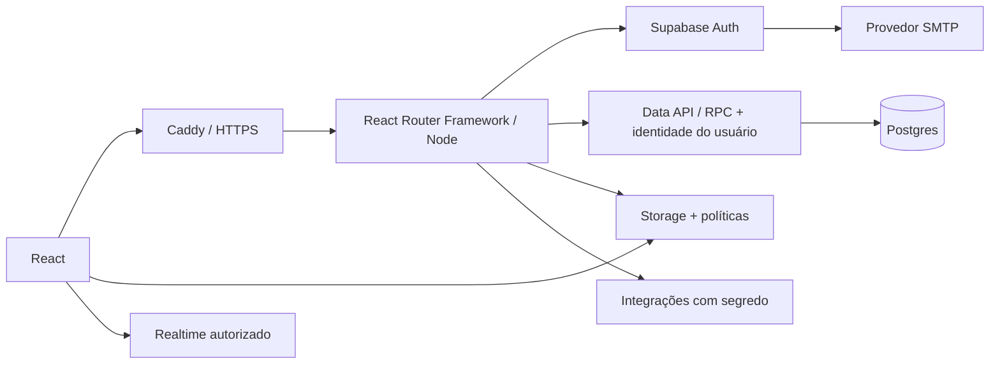

# Backend, dados e autenticação

Detalhamento do MVP conforme a [arquitetura aprovada em 22/09/2026](../specs/architecture-mvp.md). Em 26/09/2026, o responsável antecipou o schema completo para a fase zero (#116–#119), mantendo UI/Auth de produto nas fases seguintes. Este modelo orienta as migrações revisadas; ainda não declara aplicação ou homologação remota. Dados exclusivamente sintéticos; produção não é destino de ensaio.

## Componentes

```mermaid
flowchart LR
  Browser[React] --> Proxy[Caddy / HTTPS]
  Proxy --> App[React Router Framework / Node]
  App --> Auth[Supabase Auth]
  App --> API[Data API / RPC + identidade do usuário]
  API --> DB[(Postgres)]
  Browser --> Files[Storage + políticas]
  Browser --> RT[Realtime autorizado]
  App --> Files
  App --> External[Integrações com segredo]
  Auth --> Mail[Provedor SMTP]
```

Postgres é a fonte da verdade. React mantém estado de formulário e cache de leitura, sem replicar decisões de autorização. Interfaces públicas recebem somente projeções públicas; ocultar um campo no JSX não o protege.

Usar o SDK Supabase com tipos gerados. Preferir módulos pequenos por caso de uso (perfis, coletivos, eventos, mensagens), sem repositório genérico, fábrica de serviços ou abstração para múltiplos bancos. Só adicionar biblioteca de cache quando a primeira integração mostrar necessidade; não converter o projeto inteiro antecipadamente.

O Node atende SSR, loaders/actions, validação com Zod e integrações que exigem segredo. Acesso comum ao Supabase preserva a identidade do usuário e RLS; não usa `service_role`. Invariantes atômicas ficam no Postgres/RPC. Edge Functions só entram quando houver necessidade de execução independente, sem duplicar regras. Páginas públicas entregam conteúdo/metadados no HTML inicial; respostas autenticadas não entram em cache compartilhado.

## Modelo relacional proposto

UUIDs em entidades, `timestamptz` para instantes, `date` para nascimento, `created_at`/`updated_at` nas entidades mutáveis. FKs indexadas quando usadas em políticas e consultas. Valores monetários em centavos inteiros, nunca texto formatado.

| Tabela / esquema lógico | Campos principais | Relações e restrições |
|---|---|---|
| `auth.users` | identidade, e-mail, credenciais gerenciadas por Auth | Não duplicar senha. E-mail de login tem Auth como fonte. |
| `private.account_details` | `user_id`, nome, CPF normalizado, nascimento, gênero, cidade, UF, estado, WhatsApp e perfil artístico padrão | PK/FK `user_id`; CPF válido `NOT NULL UNIQUE`, alteração só pelo suporte; 18 anos completos na conclusão. Celular E.164 único e confirmação têm Auth como fonte; não aceitar confirmação declarada pelo cliente. WhatsApp adicional opcional não substitui celular verificado. Preferência referencia somente artista próprio; sem fallback se não público/excluído. |
| `profiles` | id, `owner_id`, tipo de atuação, nome, descrição, cidade, redes | Conta 1:N atuações; sem unicidade por proprietário para artista. Tipo entre artista/serviços/audiovisual/integrante. Catálogo interno autenticado expõe somente nome/descrição/cidade e início de mensagem; proprietário imutável via cliente. |
| `artist_profiles` | `profile_id`, bio, cor, foto, status público | 1:1 atuação artista, subtipo validado no banco; leitura pública apenas de perfil publicado. Estilos/subestilos em catálogo e vínculos relacionais, múltiplos estilos com subestilo opcional do mesmo estilo. Não contém contatos profissionais/CPF. |
| `professional_details` | `profile_id`, booking, contato, material restrito por tipo de atuação, `fee_cents`, CNPJ, tipo serviço | 1:1 perfil profissional; titular mantém, apenas proprietário elegível consulta conforme RN-07. `fee_cents >= 0`; material coerente com RN-35. CNPJ fica privado. |
| `profile_images` | id, `profile_id`, caminho Storage, posição, texto alternativo | Uma posição principal e até 10 posições de galeria por perfil, protegidas por constraint/índice único inclusive sob concorrência; JPG/PNG/WebP até 5 MB. |
| `collectives` | id, `owner_user_id`, nome, tipo, bio, cidade/UF, atuação, cor, imagem, redes, estado | Exatamente um proprietário atual, também membro; transferência transacional. Estado aprovado controla funções e publicação. |
| `private.collective_audit` | coletivo, ação/decisão, motivo, ator, data | Trilha das mutações e verificação editorial, consolidada na #117. Somente administração do site decide aprovação. Criador recebe somente o estado/motivo apropriado da própria solicitação. |
| `private.site_admins` | `user_id`, concedido por/em | Papel operacional separado da propriedade de coletivos; provisionado por procedimento administrativo controlado. Cliente não se promove nem altera a lista. |
| `private.collective_details` | `collective_id`, CNPJ | 1:1; criação/alteração de produtora exige CNPJ na mesma transação. Não embutir CNPJ em resposta pública. |
| `private.collective_roles` | id, `collective_id`, nome, indicador de perfil inicial | Único `(collective_id, name)`; chave `(collective_id,id)` referenciável. Perfil inicial Membro sem permissões operacionais. Sem nível numérico nem sinalizador de proprietário delegável. |
| `private.collective_role_permissions` | `collective_id`, `role_id`, chave de permissão | FK composta para perfil do mesmo coletivo; oito chaves aprovadas na #66: pedidos.gerir, membros.remover, eventos.criar/editar/publicar/cancelar, mensagens.ler/enviar. Perfis/atribuições, transferência, exclusão e diretório restrito não são delegáveis. |
| `private.collective_memberships` | `collective_id`, `user_id`, `role_id`, entrada, última atividade | PK `(collective_id,user_id)`; FK composta `(collective_id,role_id)` impede perfil de outro coletivo. Proprietário deve manter vínculo; link artístico deriva da preferência única da conta, sem escolha por vínculo. |
| `private.membership_requests` | id, coletivo, usuário, atuação desejada, mensagem, status, decisão/decisor/data | Índice único parcial `(collective_id,user_id)` onde status pendente. Estados pendente/aprovada/recusada/cancelada; histórico não é apagado ao decidir. |
| `events` | id, coletivo, nome, tipo/outro, Markdown, início, fim opcional, fuso, local, gratuito/link, capa, status | `ends_at IS NULL OR ends_at > starts_at`; ingresso gratuito XOR link; tipo outros exige texto. Rascunho, publicado e cancelado seguem RN-27; editar publicado requer também permissão de publicar. |
| `private.event_lineup` | id, evento, artista opcional, `credited_name`, ordem | Nome histórico obrigatório também para artista vinculado; FK artística `ON DELETE SET NULL`, sem UUID da conta duplicado. Exclusão da atuação/conta preserva somente o crédito textual não clicável, o evento e outros participantes (RN-25/34). Único `(event_id,artist_id)` quando não nulo. |
| `private.conversations` | id, par único de `message_identities` (atuação/coletivo), criado por, instantes | Remetente pessoal escolhe atuação própria; identidade coletiva exige coletivo aprovado e permissão atual. Destino profissional referencia uma atuação específica; projetos do mesmo titular não se misturam. Bloqueio bilateral impede novos envios, sem apagar histórico. |
| `private.message_identities` / `conversation_reads` | atuação ou coletivo; marcador por usuário/conversa | Acesso deriva do titular da atuação ou vínculo/permissão coletiva atual. Marcador não concede permissão; avanço monotônico pela mensagem da própria conversa. |
| `private.messages` / `message_requests` / `conversation_blocks` | id, conversa, identidade remetente, autor, conteúdo, instante; chave de retry; bloqueio por lado | Autor da sessão; retry único por conta/chave e fingerprint; bloqueio bilateral. Tabelas sem grants à Data API; somente RPCs. |
| `private.message_reports` | mensagem, contexto mínimo, estado, decisor, prazo de expurgo | Só equipe designada lê a cópia isolada; identidade de conta em exclusão pendente dura até conclusão da análise, no máximo 30 dias. Cópia sem identificação é expurgada até 90 dias após encerramento. |
| `private.moderation_audit` | caso, ator, ação, instante | Sem corpo de chat ou documentos; caso expirado leva sua trilha. Auditorias de coletivos/eventos permanecem específicas, sem tabela genérica adicional. |
| `private.account_deletions` / `storage_cleanup` | identidade Auth, prazo fixo, estado, prefixos de perfil | Filas privadas idempotentes para limpeza por APIs oficiais. Só concluir após Storage e Auth ausentes; operações externas ainda na #23/#21. |

O esquema `private` não será exposto pela Data API. A leitura/edição dos próprios dados de conta passa por operações específicas com autorização explícita. Caso se use view pública, `security_invoker=true`; não criar view que junte dados privados para depois “filtrar no frontend”.

Concluir cadastro exige e-mail e celular confirmados em Auth, CPF válido e idade mínima, na mesma transação que cria conta/primeira atuação. Alteração de tipo de atuação não pode contornar constraints de subtipo/material. Artista aceita presskit por link **ou** PDF até 10 MB; audiovisual só link de portfólio; serviços só PDF opcional de lista de serviços/equipamentos até 10 MB; integrante/coletivo/produtora não recebem esses campos. Mutação e acesso direto obedecem ao mesmo contrato.

Toda autorização interna consulta o estado atual da conta. Suspensão/exclusão pendente bloqueia capacidades imediatamente; apagar a conta não apaga mensagens compartilhadas, mas remove referências e identificadores do remetente na representação normal. A cópia mínima de denúncia e a identidade temporariamente retida ficam isoladas conforme RN-34, com prazo máximo de 30 dias para eliminar identidade, mantendo o caso aberto se necessário. O prazo de até 90 dias da cópia começa no encerramento do caso. Nenhuma FK deve preservar identificadores pessoais por acidente ou apagar histórico por cascata. A exceção explícita é o nome creditado no lineup, sem vínculo após exclusão, conforme RN-25/34; não se estende às mensagens.

`professional_details` pode permanecer em esquema exposto com RLS estrita, pois é separado dos dados de identidade. Uma `SELECT` de `artist_profiles` nunca inclui implicitamente essa tabela. JSONB é aceitável para redes sociais opcionais; não usar JSONB para membros, mensagens, permissões ou valores de negócio que exigem integridade relacional.

## Matriz de acesso proposta

| Recurso / operação | Autorização |
|---|---|
| Artistas/coletivos/eventos publicados | Leitura anônima somente das projeções públicas e de coletivos aprovados não suspensos. |
| Catálogo das quatro atuações | Leitura apenas por conta autenticada das projeções internas não restritas; somente artista publicado possui página individual anônima. |
| CPF, nascimento, e-mail de autenticação e dados de conta | Somente o próprio titular e operações estritamente autorizadas; perfil de coletivo não concede acesso. |
| Editar perfil pessoal/profissional | Somente o titular; propriedade do coletivo não altera isso. |
| Ler contatos/presskit/cachê e materiais restritos | O titular lê os próprios dados; o proprietário de coletivo aprovado lê os dados de terceiros somente com conta ativa, e-mail/celular confirmados e MFA. Outros membros exploram somente projeções internas não restritas, inclusive quando seu perfil tem todas as permissões operacionais delegáveis. |
| Dashboard interno | Membro atual de coletivo aprovado vê resumo com informações públicas e áreas conforme permissões efetivas. Última atividade dos membros é exclusiva do proprietário. |
| Chat pessoal | Participantes autorizados da conversa; papel coletivo não concede leitura. |
| Histórico e envio do coletivo | Proprietário ou membro atual com a permissão correspondente no coletivo aprovado. Suspenso: apenas histórico para autorizados, sem envio. Cancelado/excluído: nenhum acesso coletivo. |
| Eventos, perfis de acesso, solicitações e gestão | Proprietário executa ações operacionais; membro atual usa as oito permissões separadas no próprio coletivo aprovado. Só proprietário cria/edita/atribui perfis. Gerir pedidos admite apenas como Membro. Editar evento publicado exige editar e publicar. |
| Encerrar coletivo ou transferir propriedade | Proprietário atual, em operação transacional; nunca delegável por perfil. O suporte tem operação separada e auditada para encerramento verificado (RN-21/34/37), sem transferência arbitrária nem exclusão automática de dados compartilhados. |

Propriedade ou perfil de A jamais autoriza agir em B. O diretório profissional é a exceção de leitura global já confirmada, não uma permissão administrativa global. CPF e nascimento continuam fora dessa exceção.

**Pré-condição RN-30:** toda função interna exige coletivo aprovado. Criação gera estado pendente; dashboard, envio de mensagens, gestão, eventos e acesso ao diretório por esse vínculo permanecem bloqueados, inclusive para o proprietário. Acompanhamento do pedido é operação distinta, limitada ao criador e administração do site. Suspensão oculta páginas e buscas e preserva somente o histórico de mensagens em leitura para membros ainda autorizados. Estado de aprovação não é editável pelo proprietário nem confiado a metadados de sessão.

Administração do site pode listar pedidos, examinar dados necessários à verificação e aprovar/recusar com trilha de auditoria. Não herda acesso geral a CPF, conversas privadas ou dados profissionais. Prever MFA e provisionamento inicial fora do cadastro público. Não reintroduzir níveis numéricos paralelos aos perfis.

Políticas verificam relações atuais no banco, conta ativa e e-mail/celular confirmados quando requeridos. Não confiar em `user_metadata` editável pelo usuário. Ausência de vínculo não concede perfil inicial. `UPDATE` precisa de `USING` e `WITH CHECK`, com proprietário/coletivo protegidos contra troca. Grants explícitos e RLS entram juntos na migração; testes incluem a chamada REST direta.

## Operações atômicas

1. **Concluir cadastro:** após Auth, gravar conta privada + primeira atuação em transação. CPF duplicado deixa onboarding recuperável; não declara sucesso nem cria perfil público órfão. Reenvios têm chave de idempotência. Definir expiração de contas Auth abandonadas.
2. **Criar coletivo:** dados públicos/privados + estado pendente + perfil inicial + proprietário único vinculado na mesma transação. Produtora sem CNPJ falha sem efeitos parciais. Aprovar/recusar é outra transação, exclusiva da administração do site, com decisão auditada e proteção contra decisões concorrentes. Proprietário do coletivo nunca altera aprovação.
3. **Decidir solicitação:** travar a solicitação, verificar permissão efetiva no coletivo aprovado, exigir pedido pendente, inserir vínculo com Membro sem permissões operacionais e registrar decisão. Duplo clique/duas aprovações não duplicam membro.
4. **Transferir propriedade:** somente o proprietário atual com MFA inicia; serializar por coletivo, verificar sucessor membro elegível e com MFA, trocar o único `owner_user_id` e rebaixar o antigo proprietário a Membro na mesma transação. Remoção, saída e exclusão de conta não deixam coletivo ativo sem proprietário. Um trigger simples de contagem sem trava não resolve concorrência.
5. **Publicar evento:** evento + lineup validado, mesma transação; edição compete por versão/`updated_at`, sem sobrescrever alteração recente silenciosamente.
6. **Enviar mensagem:** verificar acesso no momento do envio, autor da sessão, persistir antes de emitir atualização. Retry não duplica; queda de Realtime recupera mensagens por cursor no banco.

Preferir RPC `SECURITY INVOKER` quando as políticas bastarem. Operações que precisam proteger invariantes contra DML direto podem exigir wrapper privilegiado estreito: revogar escrita direta, checar sessão/permissões dentro da função, fixar `search_path`, validar todos os IDs e limitar `EXECUTE`. Revisar cada exceção; funções internas em esquema privado, interface RPC exposta mínima quando necessária.

## Autenticação

- Proposta: e-mail/senha no Supabase Auth; cadastro inclui senha e confirmação (hoje ausentes), confirmação de e-mail, reenvio com limite e estados de cadastro incompleto.
- Criar jornadas de esqueci senha, retorno de recuperação, link expirado, troca de e-mail confirmada, reautenticação sensível e saída. Não alterar e-mail apenas na tabela de perfil.
- Gerenciar sessão pela integração oficial Supabase para SSR, com cliente por requisição e validação de identidade no servidor; não autorizar apenas com `getSession()`. Tratar cookies, refresh, CSRF nas mutações e isolamento de cache/memória entre usuários. Não fazer redirecionamento antes de resolver a sessão. Sem login demo no build conectado a dados reais.
- CAPTCHA e limites nas rotas de cadastro/recuperação conforme risco; SMTP próprio com remetente e domínio verificados antes do beta externo. O SMTP padrão não será critério de prontidão de produção.
- URL de retorno permitida por ambiente; sem wildcard aberto em produção. Testar link usado/expirado e redirect malicioso.
- Revogação de participação tem efeito no banco imediatamente. Logout/exclusão não deve depender de supor que todo access token expira instantaneamente. Para operação especialmente sensível, validar sessão atual conforme necessidade.
- MFA obrigatório para administração do site e para proprietários de coletivos antes de consultar o diretório restrito ou transferir a propriedade; recomendado para administradores de infraestrutura. O sucessor deve concluir MFA antes da transferência.

## Storage e consultas

Exclusão de atuação grava seu prefixo na fila privada `storage_cleanup`, inclusive durante cascata de conta. O executor de #23/#21 deve usar Storage API, preservar objetos compartilhados e confirmar remoção antes de concluir `account_deletions`; Auth Admin hard delete é obrigatório. As rotinas SQL não comprovam sozinhas esse término nem o prazo integral de 30 dias.

Imagens públicas de perfis publicados podem ter bucket público, desde que nada privado seja enviado ali. Rascunhos e documentos privados ficam em bucket privado, com acesso curto autorizado; caminho não é autorização. Upload valida tamanho, formato real e propriedade no servidor; rejeitar SVG/HTML no MVP. Remoção/substituição limpa órfãos sem apagar arquivo ainda referenciado.

Consultas usam paginação e índices de FK/escopo, com `(collective_id, starts_at)` em eventos, `(conversation_id, created_at, id)` em mensagens e `(user_id, collective_id)` em vínculos. Medir com EXPLAIN no volume de homologação. Busca inicial simples no Postgres; índice textual só conforme consulta real. Realtime apenas nas conversas autorizadas, com revogação e reconexão testadas.

Datas são armazenadas como instantes UTC; eventos usam entrada/exibição identificada em `America/Fortaleza` (RN-24). Cachê é inteiro em centavos e formato BRL apenas na UI. CPF/CNPJ são texto, nunca números. O [CNPJ alfanumérico entrou em operação em 2026](https://www.gov.br/receitafederal/pt-br/assuntos/noticias/2026/julho/receita-federal-gera-o-primeiro-cnpj-em-formato-alfanumerico); uma máscara exclusivamente numérica seria uma nova falha.

## Referências

- [RLS](https://supabase.com/docs/guides/database/postgres/row-level-security), [grants e API](https://supabase.com/docs/guides/api/securing-your-api).
- [Auth por senha](https://supabase.com/docs/guides/auth/passwords), [SMTP](https://supabase.com/docs/guides/auth/auth-smtp), [Storage](https://supabase.com/docs/guides/storage/security/access-control).
