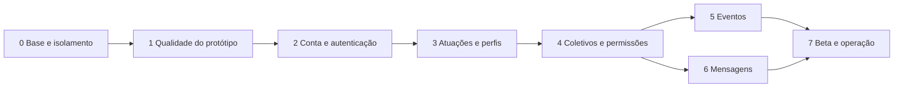

# Plano de execução

Plano baseado no protótipo e nas decisões do responsável de 21–22/09/2026, incluindo a [arquitetura aprovada](../specs/architecture-mvp.md). A preparação está em andamento; SSR, backend e funcionalidades reais não estão implementados. Execução incremental, uma tarefa revisável por PR. IDs abaixo são o backlog canônico inicial; não foram criadas dezenas de issues vazias.

## Escopo e ordem

Manter o design e os componentes aproveitáveis. Primeiro estabilizar entrega/testes, depois corrigir os riscos que contaminariam a integração. Implementar fatias completas com banco, RLS, UI, erros, teste e documentação na mesma tarefa. Não construir todas as tabelas e só depois testar jornadas.

**Todos os itens têm review normal independente**, com teste definido antes, evidência de falha esperada e sucesso, homologação no SHA final e documentação pertinente. **Toda fase termina com review completo + OWASP Top 10:2025**, inclusive quando a conclusão é “não aplicável” com justificativa. As colunas de aceite abaixo complementam esse gate comum.

## Fase 0 — Base de trabalho e limites de confiança

| Tarefa | Entrega | Aceite adicional |
|---|---|---|
| F0-T1 | Importar baseline, conectar GitHub, branch de trabalho, CI, lockfile e proteção de main | Instalação reproduzível com Node 22/pnpm 10; teste/typecheck/build/audit verdes; push direto/force push impedidos pelas regras. |
| F0-T2 | GitHub App implementador separado e suíte de aceite sob outra autoridade | Agente não consegue editar QA, settings, secrets, aprovar próprio PR nem promover produção. Testar tentativas negativas. |
| F0-T3 | Container estático no Podman Windows; preparar caminho Debian | Home, assets e deep links funcionam; arquivos internos negados; teste executável no CI; nenhuma interferência em containers existentes. |
| F0-T4 | Integrar homologação e ferramentas Supabase | CLI fixado, configuração versionada, adaptador de migrações testado, secrets mínimos no ambiente correto; migration experimental só em banco descartável, depois fluxo revisado em CircuitoNE-dev. |
| F0-T5 | Homologação/release no GitHub | Job registra SHA, project ref, checksum, URL e smoke test; produção bloqueada sem homologação. Não aceitar uma aprovação de checklist como prova de teste. |

**Saída:** pipeline real e autoridade de testes demonstrados, review F0, riscos residuais explicitados. Nesta tarefa, F0-T1 e F0-T3 são preparados/validados conforme relatório; os demais dependem de identidade, credenciais e configurações externas, não são marcados prontos.

## Fase 1 — Organização dirigida por problemas reais

| Tarefa | Entrega | Aceite adicional |
|---|---|---|
| F1-T1 | Caracterizar rotas/jornadas existentes e componentes comuns | Rotas públicas, protegidas, 404, voltar/avançar, links externos/modificadores, mudança de ID e teclado; mocks explicitamente separados. |
| F1-T2 | Remover interpolação HTML insegura no Markdown; validar links | Conteúdo com aspas, atributos/eventos, HTML e esquemas perigosos não cria markup executável. Manter recursos de formatação úteis; biblioteca mantida se necessário. |
| F1-T3 | Extrair validações do cadastro e eventos; corrigir dinheiro/datas | Testes de CPF, CNPJ alfanumérico, e-mail, URL, moeda já formatada, fim anterior ao início e fuso. Não transformar máscara em validador. |
| F1-T4 | Centralizar distinção membro/visitante e escopos de mensagens no mock | N0/N1/N2 e não membro têm diferenças testadas; trocar coletivo não mantém conversa anterior; nada vaza pela central pessoal/dashboard. |
| F1-T5 | Corrigir campos ausentes e estados compartilhados de UX | Formulários reinicializam ao mudar perfil/ID; rótulos, erro focável, loading/erro/vazio; `lang=pt-BR`; 390 px, teclado, zoom e movimento reduzido. |
| F1-T6 | Migrar roteador para React Router Framework e preparar SSR público | Preservar jornadas caracterizadas; HTML inicial e metadados com dados fictícios, HTTP 404 correto, navegação/hidratação sem regressão e código de navegador separado do servidor. |
| F1-T7 | Adaptar container e verificações para Node + Caddy | SSR e assets servidos pelo runtime correto, saúde e desligamento controlado, sem privilégios ou segredos no bundle; testes HTTP no CI. |

**Saída:** sem vulnerabilidade conhecida de conteúdo no caminho de publicação; regras isoladas do JSX quando beneficia teste; SSR público e runtime Node/Caddy preparados preservando componentes úteis. A troca do roteador foi aprovada para atender renderização pública e carregamento por rota. Autorização real depende da integração nas fases seguintes; mocks não comprovam segurança.

## Fase 2 — Identidade, conta e autenticação

| Tarefa | Entrega | Aceite adicional |
|---|---|---|
| F2-T1 | Schema de identidade privado, CPF único, nascimento obrigatório, estado de conta | RLS/grants negam leitura de terceiros; normalização e concorrência impedem CPF duplicado; nenhuma informação pessoal nos logs/erros públicos. RN-01/03/04. |
| F2-T2 | Cadastro/Auth/onboarding transacional e confirmação | Senha, e-mail duplicado, CPF duplicado, falha parcial, reenvio e retomada testados; primeira atuação coerente, sem login demo. |
| F2-T3 | Login, sessão SSR, logout e recuperação | Recarga mantém sessão real; expiração/refresh/links inválidos; callback só em URL permitida; logout e erro não mostram painel anterior; validar identidade no servidor, CSRF e duas sessões sem vazamento por memória/cache. |
| F2-T4 | Editar dados e segurança | E-mail muda via Auth confirmado; reautenticação; política de CPF/nascimento; recuperação de titular e exclusão/suspensão planejadas. |

**Pré-requisitos:** D-02 e D-03 resolvidas, SMTP operacional em homologação. **Saída:** jornada completa com duas contas reais de teste e testes REST negativos. Documentar ameaça de CPF de terceiro sem confundir unicidade com prova de identidade.

## Fase 3 — Atuações, perfis e arquivos

| Tarefa | Entrega | Aceite adicional |
|---|---|---|
| F3-T1 | Múltiplas atuações e edição de artista/serviços/audiovisual | Perfil novo persiste e aparece no local certo; proprietário B não edita A; nomes não colidem por imposição artificial. RN-02/06/09–12. |
| F3-T2 | Vitrine pública, busca e detalhes sem dados privados | HTML inicial e metadados com dados persistentes; resposta anônima não contém contatos, cachê, CPF ou nascimento; paginação, perfil ausente/404 e fotos quebradas. |
| F3-T3 | Upload, galeria e substituição de imagens | Limite/tipo/autoria validados no servidor, arquivo malicioso negado, órfãos tratados, falhas de rede recuperáveis. |

**Saída:** perfis editáveis com upload e privacidade comprovada; documentação do contrato público/profissional/privado. Nesta fase, dados profissionais são acessíveis somente ao titular. A liberação do diretório para N2 pertence a F4-T4, depois dos vínculos e permissões, evitando dependência circular entre fases.

## Fase 4 — Coletivos e autorização

| Tarefa | Entrega | Aceite adicional |
|---|---|---|
| F4-T1 | Criar coletivo/produtora pendente, cargos básicos e primeiro admin | Operação atômica; produtora sem CNPJ falha; CNPJ alfanumérico aceito; RN-30 bloqueia dashboard/funções até aprovação, inclusive para o criador. Tela de acompanhamento do pedido. |
| F4-T2 | Vínculos, cargos customizados e RLS | Matriz N0/N1/N2, outsider, usuário removido e admin de outro coletivo; cargo de A não é usado em B; último N2 protegido em concorrência. |
| F4-T3 | Solicitação, aprovação, recusa, retirada e histórico | Duplicata/retry/decisão simultânea; aprovação usa N0 obrigatório; solicitante vê estado sem acesso aos demais pedidos. |
| F4-T4 | Gestão, perfil público e diretório profissional integrado | Todos os campos persistem; HTML/metadados públicos só de coletivo aprovado e sem dados privados; troca de coletivo reinicia estado; RN-07/RN-30 comprovadas. N2 de coletivo pendente/recusado não obtém diretório; considerar outros vínculos aprovados. |
| F4-T5 | Administração do site: fila de verificação, aprovação e recusa | Papel separado de N2, provisionamento controlado, MFA, decisão auditada e concorrência; critérios de verificação/reapresentação definidos. Criador não se autoaprova; aprovado libera funções sem nova sessão. |

**Saída:** teste de permissões por operação direto na API, auditoria das mutações sensíveis, revisão completa de isolamento. Sem órfãos administrativos.

## Fase 5 — Eventos completos

| Tarefa | Entrega | Aceite adicional |
|---|---|---|
| F5-T1 | Evento + lineup transacionais, tempo e ingresso | Fuso explícito, validações do tipo, relação de datas e ingresso XOR gratuito; idempotência e autoria N2 do coletivo. |
| F5-T2 | Criar/editar/publicar/cancelar | D-04/D-05 resolvidas; rascunhos privados; alteração concorrente detectada; cancelamento comunicado na página. |
| F5-T3 | Agenda, páginas públicas e dashboard coerentes | Futuro/em andamento/passado, ordem estável, paginação, evento de artista sem vínculo no coletivo organizador e link profundo; HTML/metadados públicos, HTTP 404 e rascunhos fora de respostas públicas. |

**Saída:** cenário de ponta a ponta de produtor criar → artista aparecer no lineup → visitante consultar → evento alterar/cancelar, com conteúdo hostil e acessos cruzados testados.

## Fase 6 — Mensagens e abuso

| Tarefa | Entrega | Aceite adicional |
|---|---|---|
| F6-T1 | Criar conversas e enviar mensagens persistentes | D-06 resolvida; destinatário e remetente explícitos; participante errado/admin de outro coletivo não lê; retry não duplica. |
| F6-T2 | Leituras por usuário, histórico paginado e Realtime | Reconexão recompõe histórico; duas sessões não compartilham contador indevido; ordem estável; revogação de cargo remove acesso. |
| F6-T3 | Anti-spam, denúncia, bloqueio e operação de moderação | Limites no servidor, suspensão auditada e fluxo de denúncia definido; mensagem/cadastro em excesso falha de forma controlada. |

**Saída:** duas contas e dois coletivos em sessões distintas; nenhuma leitura cruzada; limite/indisponibilidade/reconexão testados. Contador de mensagem é derivado, não estado global do mock.

## Fase 7 — Beta e operação

| Tarefa | Entrega | Aceite adicional |
|---|---|---|
| F7-T1 | Node/Caddy no Debian/Podman, DNS/TLS, ambientes e release | Domínios próprios, imagem/artefato imutável, segredo por ambiente, rollback ensaiado; PRs não executam no host de produção. |
| F7-T2 | Privacidade, moderação, suporte e ciclo de vida da conta | Política de retenção/exclusão/exportação, responsável e canal de suporte; sem dados reais em seeds ou logs. |
| F7-T3 | Qualidade pública | Acessibilidade automatizada + manual, mobile, busca/SEO/social cards, performance com volume representativo e conexão lenta. |
| F7-T4 | Segurança e recuperação final | OWASP completo, RLS/Storage/Auth, teste de restauração DB+arquivos, logs sem PII, alertas e responsável por incidentes. |
| F7-T5 | Piloto controlado e promoção | Critérios de sucesso e grupo piloto definidos, smoke no SHA homologado, aprovação humana, acompanhamento e rollback disponível. |

**Saída:** liberação consciente do MVP, sem P0/P1, sem pendência de privacidade/controle de acesso ou restauração. Não declarar pronto com base apenas no build.

## Revisão crítica deste plano

- CPF obrigatório aumenta a responsabilidade operacional; resolver recuperação, titularidade alegada, retenção e conta duplicada antes de abrir cadastro.
- D-01 foi resolvida: criar coletivo não libera dashboard/funções; aprovação da administração do site é obrigatória (RN-30). F4 inclui um papel operacional e uma fila que não existiam no protótipo. Os critérios de verificação precisam ser executáveis por quem operará o site.
- Apenas duas instâncias Supabase existem; homologação compartilhada não serve para `reset` de cada PR. Usar banco descartável local/CI para testes destrutivos, serializar migrations compartilhadas.
- Região da homologação é São Paulo e produção é US West. Verificar latência, residência pretendida e eventual reprovisionamento antes dos primeiros dados reais; não migrar automaticamente.
- Supabase gerenciado continua dependência externa mesmo com frontend em Debian próprio. Fazer self-host do Supabase não está incluído.
- O GitHub App está conectado e foi destinado a toda a organização. Tokens de cada execução são limitados ao projeto; a suíte externa deve ficar em outra conta/organização sem esse App. A chave e a credencial humana precisam sair do alcance do implementador para haver isolamento forte. O aceite verifica a aplicação, sem confiar no runner do candidato.
- SMTP, backup de Storage, DNS/TLS, perda do host, moderação, acessibilidade e SEO não estavam cobertos pelo mock; agora têm tarefas e gates.
- Não estimar calendário antes de fechar decisões de produto e disponibilidade do responsável. Avançar por aceite, com tarefas pequenas; dividir item que não caiba em um diff revisável.

## Cobertura do pedido original

| Item | Entrega |
|---|---|
| 1 Backend | specs/architecture-mvp.md + architecture/backend-and-data.md; proposta histórica no ADR |
| 2 GitHub/CI/infra | Workflows, CODEOWNERS, environment.md e F0/F7 |
| 3 Telas faltantes | reviews/prototype-audit.md e F1–F6 |
| 4 Regras decididas | business-rules/mvp.md, com fontes e estados |
| 5 Banco/Auth | Modelo, matriz RLS, transações e F2–F6 |
| 6 Fases e revisões | Este backlog + engineering/delivery.md |
| 7 TDD isolado | Autoridades, suíte canônica externa e testes negativos de permissão |
| 8 Documentação | Matriz por tarefa/fase em delivery.md |
| 9 Ambiente | Node/pnpm, CI, container local e relatório de validação |
| 10 Revisão do plano | Riscos acima, decisões abertas e segurança-baseline.md |
