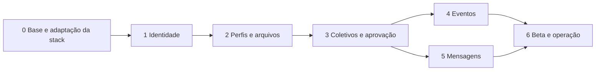

# Plano de implementação

**Revisão 3 — 22/09/2026.** Planos executáveis para a [arquitetura aprovada](../specs/architecture-mvp.md). A fase zero concentra adaptação à stack, limpeza, upgrades e remoção antecipada de bloqueios. Cada tarefa distingue issues de entrada das que deve resolver. Os documentos detalham trabalho futuro; não declaram a implementação concluída.

## Fases e dependências

| Fase | Plano detalhado | Entrega e gate principal |
|---|---|---|
| 0 | [Base, testes, limpeza e stack](phases/00-foundation.md) | React Router Framework/SSR, Node/Caddy, CI/homologação e autoridade independente de testes |
| 1 | [Identidade e autenticação](phases/01-identity.md) | Conta privada, CPF único, onboarding, sessão SSR e recuperação |
| 2 | [Atuações, perfis e arquivos](phases/02-profiles.md) | Edição por titular, catálogo SSR e Storage com políticas |
| 3 | [Coletivos e aprovação](phases/03-collectives.md) | Aprovação pelo site, cargos/vínculos, gestão e diretório restrito |
| 4 | [Eventos](phases/04-events.md) | Evento/lineup atômicos, publicação/cancelamento e agenda SSR |
| 5 | [Mensagens e abuso](phases/05-messaging.md) | Histórico persistente, leitura individual, Realtime e moderação |
| 6 | [Beta e operação](phases/06-beta.md) | Debian, privacidade, qualidade final, restauração e liberação controlada |

São **38 tarefas**, identificadas nos planos. F0-T14 trata dependências e F0-T15 antecipa decisões/pré-requisitos; os IDs anteriores foram preservados. Eventos e mensagens podem avançar independentemente depois dos respectivos pré-requisitos de coletivos; isso não dispensa os reviews de fase. Se uma tarefa não couber em um diff revisável, dividir em subtarefas com sufixos, mantendo o vínculo ao contrato original.

## Estado real e próximo passo

- GitHub/App, CI, documentação e preview estático foram integrados pelo [PR #2](https://github.com/IgnisDevNE/CircuitoNE/pull/2) em 22/09/2026. F0-T1/T3 não equivalem a fase zero completa.
- SSR, backend, Auth, banco de negócio e funcionalidades persistentes continuam pendentes. O preview segue com mocks.
- F0-T2 está parcial: o QA independente já executa o aceite obrigatório e promove a suíte após o merge ([controle de mudanças](../controls/change-control.md)); faltam os ensaios negativos, a proteção efetiva do QA e a retirada das credenciais humanas/chaves do ambiente implementador ([#31](https://github.com/IgnisDevNE/CircuitoNE/issues/31)). A retomada após aprovação e o fechamento da proposta estão implementados no QA; o ensaio real e a conclusão ficam na [#58](https://github.com/IgnisDevNE/CircuitoNE/issues/58).
- Codecov: upload real no Cloud em `main` e PR validado. O responsável escolheu voltar à instância própria; verificar acesso/organização ([#29](https://github.com/IgnisDevNE/CircuitoNE/issues/29)), configurar servidor e comprovar upload antes de trocar o CI ([#30](https://github.com/IgnisDevNE/CircuitoNE/issues/30)). Dependabot/forks ainda exigem evidência própria.
- Próximo trabalho: partir de `main` atualizada e branch nova; priorizar F0-T14/T15, F0-T2 e F0-T6 nas partes independentes. Resolver o máximo de bloqueios na fase zero; preparação com fixtures pode avançar sem tratar pendências como aprovadas. [Parecer por PR do Dependabot](../reviews/dependabot-2026-09-22.md).

## Contrato comum de cada tarefa

1. Vincular RN/decisão, definir critérios e negações, escopo, dependências, risco e responsável por revisão. Identificar issues bloqueantes e o pré-requisito que deve ser resolvido antes do trecho dependente. Separar essas issues das que a própria tarefa resolve; não criar ciclo exigindo que a correção termine antes de começar. Em issue com várias partes, registrar evidência do pré-requisito atendido; o restante continua aberto. Pendência de produto bloqueia apenas o trabalho que depende dela; não inventar resposta.
2. Escrever teste primeiro e registrar falha pelo comportamento ausente. O contrato de aceite é revisado e fixado fora da autoridade do implementador. Caracterização já correta pode começar verde; documentação recebe revisão de consistência, links e evidências.
3. Implementar o menor incremento completo: UI/servidor/banco/políticas quando necessários, com falhas, autorização e documentação. Não construir todo o schema antes de testar a primeira jornada.
4. Rodar verificações pertinentes: unidade/interação, TypeScript/build, API/RLS/Storage/concorrência, jornada e acessibilidade afetadas. Registrar SHA final e versão do oráculo; cobertura é evidência auxiliar.
5. Review normal independente do diff e dos contratos/testes. Resolver P0/P1; risco residual aceito precisa de responsável e prazo. Todo achado deferido, dívida técnica ou bug não resolvido deve ter issue aberta vinculada, conforme `AGENTS.md`; abrir issue não dispensa o gate. O implementador não é seu único aprovador.
6. Homologar alterações executáveis pelo GitHub no `CircuitoNE-dev`, com migrations/checksums, artefato e smoke. Nenhum teste de schema em produção. Documentar aplicabilidade quando o PR só altera documentos.
7. Após aprovação e conclusão, limpar a branch e iniciar o próximo trabalho a partir de `main` atualizada.

Detalhes de credenciais, TDD e autoridade do verificador em [delivery.md](../engineering/delivery.md). Workflows e configurações administrativas que excedam as permissões do App passam pelo mantenedor; não usar a credencial humana como fallback do agente.

## Gate de cada fase

Produzir `docs/reviews/phase-N.md` com review completo: jornadas e erros, arquitetura, dados/RLS, acessibilidade, desempenho, operação e documentação. Acrescentar **as dez categorias OWASP Top 10:2025**, com evidência, severidade/tratamento ou justificativa concreta de não aplicabilidade. Usar a [matriz de segurança](../reviews/security-baseline.md).

O resultado é aprovado ou bloqueado no SHA exato. Autoavaliação e scanners não substituem revisão independente. Não iniciar a parte de uma fase que depende de gate reprovado. O relatório final registra pendências com dono, escopo afetado e condição de encerramento.

Os blocos **Bloqueios por issue** dos planos registram requisitos de entrada. **Issues tratadas** registram o escopo a resolver durante a tarefa, não bloqueios para iniciá-la. As dependências de tarefas propagam seus bloqueios; os links explícitos destacam a causa aberta e não substituem o gate da fase. Revalidar estado das issues antes de iniciar e atualizar links/condições quando surgirem novos achados.

## Documentação por tarefa e fase

| Momento | Registro necessário |
|---|---|
| Antes da implementação | Contrato/critério no PR ou tarefa, RNs, SHA dos testes de aceite e decisões pendentes |
| Cada tarefa | Escopo, vermelho/verde, validações, revisão, SHA, homologação, riscos e recuperação; `docs/tasks/Fx-Ty.md` somente se a evidência não couber no PR |
| Mudança de contrato técnico | Atualizar `docs/specs/` e seu índice; ADR apenas quando houver contexto/alternativas/consequências relevantes a registrar |
| Regra ou banco | Atualizar regra canônica, contratos/políticas e migração correspondente; não duplicar SQL editável |
| Cada fase | `docs/reviews/phase-N.md`, review completo, OWASP, evidências e gate final |
| Operação/release | Comandos verificados, responsáveis, SHA/artefato, migrations e plano de recuperação |

## Pendências e condições de encerramento

| ID | Pendência / responsável | Efeito e aceite |
|---|---|---|
| [DEF-01](https://github.com/IgnisDevNE/CircuitoNE/issues/29) | Autorizar OAuth CodeCov na IgnisDevNE / proprietário da organização | Sincronizar associação sem 403 e confirmar organização na conta. Deferido; não bloqueia testes locais, planejamento ou demais tarefas |
| [DEF-02](https://github.com/IgnisDevNE/CircuitoNE/issues/30) | Publicar cobertura no Codecov / mantenedor + implementação F0-T13 | Relatório real no SHA correto, token restrito e publicação isolada. Até lá, artefato local/CI; sem declarar cobertura remota validada |
| [F0-T2](https://github.com/IgnisDevNE/CircuitoNE/issues/31) | Isolamento do QA/emissor/implementador / mantenedor | Barreira obrigatória antes de agentes implementarem regras reais; demonstrar testes negativos, incluindo ausência de credenciais administrativas locais |
| [F0-T4/T5](https://github.com/IgnisDevNE/CircuitoNE/issues/32) | Credenciais e fluxo real de homologação / mantenedor + implementação | Testar o fluxo no projeto correto; não promover só por CI verde |
| [D-02/D-03](https://github.com/IgnisDevNE/CircuitoNE/issues/38) | Idade, CPF, recuperação e retenção / responsável pelo produto | Decisões aprovadas em 22/09/2026; integrar registro revisado antes dos contratos afetados da fase 1. Implementação e isolamento seguem pendentes |
| [D-08/D-10](https://github.com/IgnisDevNE/CircuitoNE/issues/39) | Arquivos/cotas e dados sociais / responsável pelo produto | Decisões aprovadas em 22/09/2026; integrar registro revisado antes das tarefas afetadas da fase 2. Uploads e edição real seguem pendentes |
| [D-01/D-09, RN-20/21/36](https://github.com/IgnisDevNE/CircuitoNE/issues/40) | Verificação/suspensão, diretório, perfil padrão, invariantes e contato WhatsApp / responsável pelo produto | Decisões aprovadas em 22/09/2026; integrar registro revisado antes dos contratos afetados. WhatsApp entra na fase 1, padrão da conta na fase 2 e coletivos na fase 3; implementação pendente |
| [D-04/D-05](https://github.com/IgnisDevNE/CircuitoNE/issues/41) | Tempo e estados do evento / responsável pelo produto | Decisão ratificada em 23/09/2026; integrar registro e implementar/testar na fase 4 |
| [D-06/D-07, RN-29/34/37](https://github.com/IgnisDevNE/CircuitoNE/issues/42) | Iniciação/moderação de mensagens, suspensão e retenção / responsável pelo produto | Decisão ratificada em 23/09/2026; integrar registro; operação de privacidade completa antes do beta |
| [Perfis de acesso](https://github.com/IgnisDevNE/CircuitoNE/issues/66) | Catálogo, Membro inicial e propriedade / responsável pelo produto | Decisão ratificada em 23/09/2026; integrar registro e implementar/testar na fase 3 |
| [Região, domínio, recuperação](https://github.com/IgnisDevNE/CircuitoNE/issues/43) | Região Supabase, DNS, SMTP, RPO/RTO / responsável operacional | Definir nas tarefas correspondentes, antes de dados reais/liberação |

As decisões [#38](https://github.com/IgnisDevNE/CircuitoNE/issues/38)–[#42](https://github.com/IgnisDevNE/CircuitoNE/issues/42) e a preparação [#43](https://github.com/IgnisDevNE/CircuitoNE/issues/43) são antecipadas para F0-T15; o momento limite das tabelas continua indicando qual implementação fica bloqueada se não forem resolvidas. F0-T14 acompanha [#34](https://github.com/IgnisDevNE/CircuitoNE/issues/34)–[#37](https://github.com/IgnisDevNE/CircuitoNE/issues/37) e os PRs de dependências. O alvo é encerrar o máximo na fase zero, mantendo abertas as partes que realmente dependem de funcionalidades futuras.

## Revisão crítica do plano

Preservar componentes úteis; limpar os riscos identificados, sem reescrita geral ou exclusão automática por métricas de código morto. O roteador precisa mudar por SSR, enquanto detalhes de formulários são extraídos conforme seus testes. Não tocar arquivos locais de outros trabalhos sem revisão própria.

Supabase gerenciado permanece dependência externa. Homologação compartilhada não recebe reset de PR; testes destrutivos usam banco descartável. Ambos os projetos ativos estão em São Paulo, mas ainda sem schema de negócio. Backup de Postgres não recupera automaticamente objetos do Storage. Runtime em um host exige plano de recuperação.

CPF obrigatório exige tratamento de titularidade alegada, recuperação e retenção. Criação de coletivo não libera privilégios: a fila de aprovação e o papel operacional são funcionalidades novas, com telas e testes próprios. Limites de abuso precisam proteger a operação acessível diretamente, inclusive Supabase, e não só o proxy do frontend.

Não estimar calendário sem fechar dependências e disponibilidade de revisão. Avançar por evidência. Codecov não substitui TDD, QA independente ou homologação; sua pendência externa não deve paralisar trabalho seguro já autorizado.

## Migração dos IDs da revisão anterior

| Identificação anterior | Identificação atual |
|---|---|
| F0-T1–T5 | Mantidas |
| F1-T1–T7 (organização do protótipo) | F0-T6–T12, respectivamente |
| F2-T1–T4 | F1-T1–T4 |
| F3-T1–T3 | F2-T1–T3 |
| F4-T1–T5 | F3-T1–T5 |
| F5-T1–T3 | F4-T1–T3 |
| F6-T1–T3 | F5-T1–T3 |
| F7-T1–T5 | F6-T1–T5 |
| Cobertura/Codecov | Nova F0-T13 |

O conteúdo histórico de relatórios antigos continua sendo evidência do momento da inspeção. Os vínculos ativos do plano, da spec, das regras e da auditoria foram ajustados; nenhuma tarefa foi considerada concluída por renumeração.
