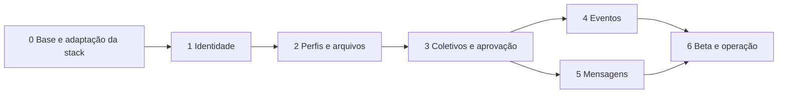

# Plano de implementação

**Revisão 5 — 02/10/2026.** Planos executáveis para a [arquitetura aprovada](../specs/architecture-mvp.md). A fase zero concentra adaptação à stack, limpeza, upgrades e remoção antecipada de bloqueios. Cada tarefa distingue issues de entrada das que deve resolver. Os documentos detalham trabalho futuro; não declaram a implementação concluída.

## Fases e dependências

| Fase | Plano detalhado | Entrega e gate principal |
|---|---|---|
| 0 | [Base, testes, limpeza e stack](phases/00-foundation.md) | React Router Framework/SSR, Node/Caddy, CI/homologação e autoridade independente de testes |
| 1 | [Identidade e autenticação](phases/01-identity.md) | Conta privada, CPF único, onboarding, sessão SSR e recuperação |
| 2 | [Atuações, perfis e arquivos](phases/02-profiles.md) | Edição por titular, catálogo SSR e Storage com políticas |
| 3 | [Coletivos e aprovação](phases/03-collectives.md) | Aprovação pelo site, cargos/vínculos, gestão e diretório restrito |
| 4 | [Eventos](phases/04-events.md) | Evento/lineup atômicos, publicação/cancelamento e agenda SSR |
| 5 | [Mensagens e abuso](phases/05-messaging.md) | Histórico persistente, leitura individual, Realtime e moderação |
| 6 | [Beta e operação](phases/06-beta.md) | Debian, privacidade, qualidade final, restauração e liberação controlada |

```mermaid
flowchart LR
  F0[0 Base e adaptação da stack] --> F1[1 Identidade]
  F1 --> F2[2 Perfis e arquivos]
  F2 --> F3[3 Coletivos e aprovação]
  F3 --> F4[4 Eventos]
  F3 --> F5[5 Mensagens]
  F4 --> F6[6 Beta e operação]
  F5 --> F6
```

São **38 tarefas**, identificadas nos planos. F0-T14 trata dependências e F0-T15 antecipa decisões/pré-requisitos; os IDs anteriores foram preservados. Eventos e mensagens podem avançar independentemente depois dos respectivos pré-requisitos de coletivos; isso não dispensa os reviews de fase. Se uma tarefa não couber em um diff revisável, dividir em subtarefas com sufixos, mantendo o vínculo ao contrato original.

## Estado real e próximo passo

- SSR/Node 24/TypeScript 7 e o schema completo do MVP (#116–#119) estão integrados. O dev mantém fixtures na interface; produção serve apenas espera, sem cadastro ou dados reais.
- [#30](https://github.com/IgnisDevNE/CircuitoNE/issues/30) e [#31](https://github.com/IgnisDevNE/CircuitoNE/issues/31) estão encerradas: Codecov próprio/Dependabot genuíno comprovados e implementador isolado, com autoridade QA independente. As decisões #38–#42/#66 estão registradas; não são novas decisões pendentes.
- [#32](https://github.com/IgnisDevNE/CircuitoNE/issues/32) concluída pela [homologação 37072463740](https://github.com/IgnisDevNE/CircuitoNE/actions/runs/37072463740), no SHA `1f0eed78017becf03126a742b3351e9a1462ac74`: manifesto, cinco migrações, quatro seeds sintéticos e SQL/REST/Auth/MFA validados; CI também comprovou promoção/rollback da imagem em destino descartável. [Revisão de saída e recibos](../reviews/phase-0.md).
- **Fase zero aceita:** reboot/login real da [#43](https://github.com/IgnisDevNE/CircuitoNE/issues/43) e retomada manual revisada concluídos em 02/10. A falha da tarefa automática tem diagnóstico separado na [#149](https://github.com/IgnisDevNE/CircuitoNE/issues/149). F1-T1a está em execução na [PR #150](https://github.com/IgnisDevNE/CircuitoNE/pull/150); homologação do novo SHA é obrigatória antes de publicar o login.
- **Continuação proposta:** uma fatia de sessão SSR/login/logout com duas contas Auth sintéticas de teste (F1-T1a), reutilizando o schema, antes do cadastro completo. [Plano e critérios](phases/01-identity.md#primeira-fatia-após-o-gate-da-fase-zero). A confirmação operacional do celular fica na [#147](https://github.com/IgnisDevNE/CircuitoNE/issues/147), bloqueando F1-T2, sem bloquear essa fatia. Callbacks só serão configurados quando houver handler revisado.
- [#104](https://github.com/IgnisDevNE/CircuitoNE/issues/104) permanece o último gate técnico pré-release; [#144](https://github.com/IgnisDevNE/CircuitoNE/issues/144) trata disponibilidade e [#145](https://github.com/IgnisDevNE/CircuitoNE/issues/145) manutenção do QA. As issues de produto permanecem abertas até suas jornadas reais passarem. Nenhum dado real antes dos gates de lançamento.

## Contrato comum de cada tarefa

1. Vincular RN/decisão, definir critérios e negações, escopo, dependências, risco e responsável por revisão. Identificar issues bloqueantes e o pré-requisito que deve ser resolvido antes do trecho dependente. Separar essas issues das que a própria tarefa resolve; não criar ciclo exigindo que a correção termine antes de começar. Em issue com várias partes, registrar evidência do pré-requisito atendido; o restante continua aberto. Pendência de produto bloqueia apenas o trabalho que depende dela; não inventar resposta.
2. Escrever teste primeiro e registrar falha pelo comportamento ausente. O contrato de aceite é revisado e fixado fora da autoridade do implementador. Caracterização já correta pode começar verde; documentação recebe revisão de consistência, links e evidências.
3. Implementar o menor incremento completo: UI/servidor/banco/políticas quando necessários, com falhas, autorização e documentação. Na F0, antecipar schema completo em quatro fatias, cada uma com testes SQL/RLS/RPC antes da migração e seeds sintéticos; jornadas de UI continuam nas fases seguintes.
4. Rodar verificações pertinentes: unidade/interação, TypeScript/build, API/RLS/Storage/concorrência, jornada e acessibilidade afetadas. Registrar SHA final e versão do oráculo; cobertura é evidência auxiliar.
5. Review normal independente do diff e dos contratos/testes. Resolver P0/P1; risco residual aceito precisa de responsável e prazo. Todo achado deferido, dívida técnica ou bug não resolvido deve ter issue aberta vinculada, conforme `AGENTS.md`; abrir issue não dispensa o gate. O implementador não é seu único aprovador.
6. Homologar alterações executáveis pelo GitHub no `CircuitoNE-dev`, com migrations/checksums, artefato e smoke. Nenhum teste de schema em produção. Documentar aplicabilidade quando o PR só altera documentos.
7. Após aprovação e conclusão, limpar a branch e iniciar o próximo trabalho a partir de `main` atualizada.

Detalhes de credenciais, TDD e autoridade do verificador em [delivery.md](../engineering/delivery.md). Workflows e configurações administrativas que excedam as permissões do App passam pelo mantenedor; não usar a credencial humana como fallback do agente.

## Gate de cada fase

Produzir `docs/reviews/phase-N.md` com review completo: jornadas e erros, arquitetura, dados/RLS, acessibilidade, desempenho, operação e documentação. Acrescentar **as dez categorias OWASP Top 10:2025**, com evidência, severidade/tratamento ou justificativa concreta de não aplicabilidade. Usar a [matriz de segurança](../reviews/security-baseline.md).

O resultado é aprovado ou bloqueado no SHA exato. Autoavaliação e scanners não substituem revisão independente. Não iniciar a parte de uma fase que depende de gate reprovado. O relatório final registra pendências com dono, escopo afetado e condição de encerramento.

Os blocos **Bloqueios por issue** dos planos registram requisitos de entrada. **Issues tratadas** registram o escopo a resolver durante a tarefa, não bloqueios para iniciá-la. As dependências de tarefas propagam seus bloqueios; os links explícitos destacam a causa aberta e não substituem o gate da fase. Revalidar estado das issues antes de iniciar e atualizar links/condições quando surgirem novos achados.

## Documentação por tarefa e fase

| Momento | Registro necessário |
|---|---|
| Antes da implementação | Contrato/critério no PR ou tarefa, RNs, SHA dos testes de aceite e decisões pendentes |
| Cada tarefa | Escopo, vermelho/verde, validações, revisão, SHA, homologação, riscos e recuperação; `docs/tasks/Fx-Ty.md` somente se a evidência não couber no PR |
| Mudança de contrato técnico | Atualizar `docs/specs/` e seu índice; ADR apenas quando houver contexto/alternativas/consequências relevantes a registrar |
| Regra ou banco | Atualizar regra canônica, contratos/políticas e migração correspondente; não duplicar SQL editável |
| Cada fase | `docs/reviews/phase-N.md`, review completo, OWASP, evidências e gate final |
| Operação/release | Comandos verificados, responsáveis, SHA/artefato, migrations e plano de recuperação |

## Pendências e condições de encerramento

| Estado / issues | Responsável e próximo aceite |
|---|---|
| Concluídas: #29/#30, #31, #32, #34–#42/#66, #116–#119 | Evidências nas issues e na [revisão de saída](../reviews/phase-0.md). Decisão aprovada e schema homologado não equivalem a UI de produto pronta. |
| [#43](https://github.com/IgnisDevNE/CircuitoNE/issues/43), único gate F0 restante | Mantenedor combina reboot/login; implementação compara a recuperação com o preflight. Conferir tarefa, pods, serviços existentes, IP da VM, tunnel, DNS/HTTPS e Access, sem alterar serviços alheios. |
| [#147](https://github.com/IgnisDevNE/CircuitoNE/issues/147), F1-T2 | Mantenedor escolhe canal/provedor de código para celular e limites/custo; implementação prova envio restrito e confirmação. Bloqueia cadastro integrado, não sessão sintética F1-T1a. |
| #12–#28, produto | Implementação das fases 1–6 e revisão de produto. Cada issue mantém seu aceite; partes resolvidas no schema não encerram fluxos ainda simulados. O alerta CodeQL de imagem continua na [#21](https://github.com/IgnisDevNE/CircuitoNE/issues/21). |
| [#145](https://github.com/IgnisDevNE/CircuitoNE/issues/145), manutenção QA | Mantenedor/identidade QA corrigem a entrada obsoleta em PR próprio antes de atualizar a Action; não ampliar o token do implementador. |
| [#144](https://github.com/IgnisDevNE/CircuitoNE/issues/144), pré-release | Mantenedor define disponibilidade do Supabase antes do lançamento; não bloqueia ensaios sintéticos. |
| [#104](https://github.com/IgnisDevNE/CircuitoNE/issues/104), último gate técnico pré-release | Chave fora do agente, cifra de banco e Storage, restauração cifrada, falha fechada, backup de produção e revisão de segurança antes de qualquer dado real. |

## Revisão crítica do plano

Preservar componentes úteis; limpar os riscos identificados, sem reescrita geral ou exclusão automática por métricas de código morto. O roteador precisa mudar por SSR, enquanto detalhes de formulários são extraídos conforme seus testes. Não tocar arquivos locais de outros trabalhos sem revisão própria.

Supabase gerenciado permanece dependência externa. Homologação compartilhada não recebe reset de PR; testes destrutivos usam banco descartável. Ambos os projetos ativos estão em São Paulo; `CircuitoNE-dev` tem o schema completo homologado e dados sintéticos, enquanto produção permanece sem migrações de negócio. Backup de Postgres não recupera automaticamente objetos do Storage. Runtime em um host exige plano de recuperação.

CPF obrigatório exige tratamento de titularidade alegada, recuperação e retenção. Criação de coletivo não libera privilégios: a fila de aprovação e o papel operacional são funcionalidades novas, com telas e testes próprios. Limites de abuso precisam proteger a operação acessível diretamente, inclusive Supabase, e não só o proxy do frontend.

Não estimar calendário sem fechar dependências e disponibilidade de revisão. Avançar por evidência. Codecov não substitui TDD, QA independente ou homologação; sua pendência externa não deve paralisar trabalho seguro já autorizado.

## Migração dos IDs da revisão anterior

| Identificação anterior | Identificação atual |
|---|---|
| F0-T1–T5 | Mantidas |
| F1-T1–T7 (organização do protótipo) | F0-T6–T12, respectivamente |
| F2-T1–T4 | F1-T1–T4 |
| F3-T1–T3 | F2-T1–T3 |
| F4-T1–T5 | F3-T1–T5 |
| F5-T1–T3 | F4-T1–T3 |
| F6-T1–T3 | F5-T1–T3 |
| F7-T1–T5 | F6-T1–T5 |
| Cobertura/Codecov | Nova F0-T13 |

O conteúdo histórico de relatórios antigos continua sendo evidência do momento da inspeção. Os vínculos ativos do plano, da spec, das regras e da auditoria foram ajustados; nenhuma tarefa foi considerada concluída por renumeração.
