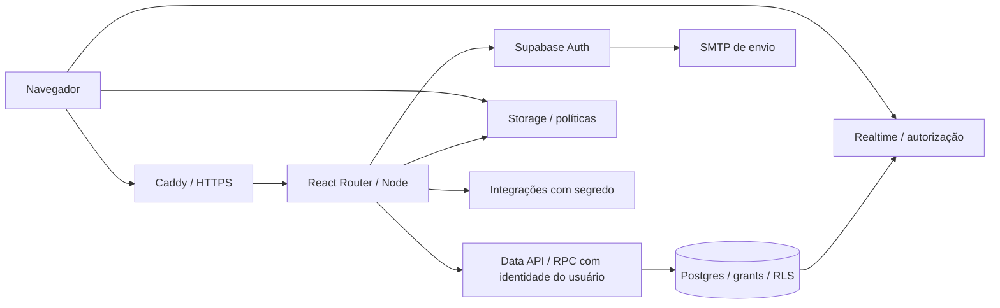

# Especificação — Arquitetura do MVP CircuitoNE

**Estado:** arquitetura aprovada pelo responsável em 22/09/2026. **Revisão:** 2, com adaptação da stack incorporada à fase zero conforme o plano detalhado.

Este documento registra a arquitetura acordada para implementação posterior. O sistema atual continua sendo um protótipo React/Vite com dados em memória, roteador próprio e container estático Caddy. A aprovação desta spec não significa que SSR, backend, autenticação ou persistência já estejam implementados.

## Objetivo e escopo

Entregar catálogo público de artistas, coletivos e eventos, contas com múltiplas atuações, gestão de coletivos e mensagens. Preservar o design e os componentes úteis do protótipo, com autorização real, páginas públicas acessíveis a buscadores e compartilhamento, e operação em infraestrutura própria para a aplicação.

As [regras de negócio](../business-rules/mvp.md) continuam sendo a fonte canônica do produto. Esta spec substitui as escolhas de SPA exclusiva, roteador próprio e runtime exclusivamente estático da [proposta inicial](../decisions/0001-foundation.md). O [modelo relacional detalhado](../architecture/backend-and-data.md) continua proposto, sujeito ao aceite de cada tarefa e às decisões de produto pendentes.

## Stack aprovada

| Camada | Escolha | Responsabilidade |
|---|---|---|
| Interface | React, TypeScript estrito e Tailwind CSS | Reaproveitar componentes, formulários e estilos do protótipo |
| Rotas e renderização | React Router em Framework Mode, integrado ao Vite | SSR das páginas públicas, navegação interativa, carregamento e ações por rota |
| Backend da aplicação | Node.js, no mesmo projeto do framework | Renderização, orquestração, validação e operações que precisam de segredo |
| Dados | Postgres gerenciado no Supabase | Persistência, constraints, transações, índices, grants e RLS |
| Identidade | Supabase Auth e integração oficial de SSR | Cadastro, confirmação, sessão, recuperação e MFA operacional |
| Arquivos | Supabase Storage | Imagens e documentos com políticas de acesso e limites de upload |
| Atualização de mensagens | Supabase Realtime | Notificar mudanças autorizadas; mensagens permanecem no Postgres |
| Validação de entrada | Zod | Validar contratos nas fronteiras; compartilhar schemas quando útil |
| Testes | Vitest, React Testing Library, Playwright e SQL/pgTAP | Unidade/interação, jornadas e integridade/autorização no banco |
| Execução | Containers Podman, Node e Caddy | Windows agora; Debian próprio posteriormente; HTTPS e proxy reverso |

As versões exatas serão fixadas na migração e verificadas em conjunto. React 19, Tailwind 4 e o toolchain já registrado no repositório são o ponto de partida; nenhuma atualização de dependência é feita por este documento.

## Componentes e fluxo

Manter um **monólito modular**: contas, perfis, coletivos, eventos, mensagens e administração do site. São módulos do mesmo sistema, sem serviços separados por domínio. O servidor atende loaders/actions e SSR; o cliente mantém estado de interface e usa as integrações necessárias de Auth, Storage e Realtime.

O acesso comum ao banco usa a identidade autenticada do usuário, inclusive no Node, para preservar RLS. Uma chamada direta à API Supabase continua sujeita às mesmas regras: passar pelo servidor não pode ser a única proteção dos dados.

### Responsabilidade das regras

- **React:** interação, feedback e validação para usabilidade. Não decide autorização definitiva.
- **Node:** validação confiável de entradas, sessão, orquestração e integrações externas com segredo. Compartilhar casos de uso entre rotas quando houver reutilização real.
- **Postgres/RPC:** autorização dos dados e invariantes transacionais, como aprovar uma solicitação, criar vínculos e impedir a remoção concorrente do último administrador. Preferir constraints e funções pequenas a verificações dispersas.
- **Edge Functions:** somente quando uma operação justificar execução independente. Não criar a mesma regra no Node e em uma Edge Function por padrão.

Usar o SDK Supabase com tipos gerados e migrações SQL em [docs/migrations/](../migrations/README.md). Não introduzir ORM, API separada, GraphQL, microserviços, Redis ou filas sem requisito concreto.

## Renderização e experiência pública

Páginas públicas de artistas, coletivos e eventos devem entregar conteúdo e metadados relevantes no HTML inicial: título, descrição, URL canônica e informações de compartilhamento. Recurso inexistente ou não publicável deve ter resposta HTTP apropriada, sem expor conteúdo restrito. Prerender pode atender páginas estáveis quando fizer sentido.

Painéis e formulários mantêm navegação React interativa. O framework pode renderizar partes dessas telas no servidor, sempre com autorização e isolamento por requisição. Dados pessoais, mensagens e respostas com sessão não entram em cache compartilhado. Cache público só pode conter projeções públicas e precisa respeitar alterações de publicação.

A migração deve preservar links profundos, parâmetros, voltar/avançar, navegação por teclado, estados de carregamento/erro/vazio e recuperação de formulários. Separar acesso a APIs do navegador do código executável no servidor e evitar estado global mutável que misture usuários durante SSR.

## Segurança e identidade

1. Separar dados públicos, profissionais restritos e privados de identidade em estruturas distintas. Nunca enviar campos privados para depois ocultá-los na interface.
2. CPF normalizado e nascimento continuam obrigatórios. Unicidade de CPF deve ser garantida no banco, inclusive sob concorrência; ela não comprova a identidade da pessoa. CPF, tokens e conteúdo de mensagens não devem aparecer em logs.
3. Contatos, presskit, portfólio audiovisual, cachê e lista de serviços/equipamentos são acessíveis ao titular e aos administradores N2 elegíveis conforme RN-07: conta ativa, e-mail/celular confirmados e vínculo atual em coletivo aprovado. Os campos por tipo seguem RN-35 (presskit de artista, portfólio audiovisual por link e lista de serviços/equipamentos em PDF privado); coletivos/produtoras não cadastram esses materiais. A criação de coletivo gera estado pendente: dashboard e funções internas ficam bloqueados até a aprovação pela administração do site, conforme RN-30.
4. Administração do site é papel separado dos cargos do coletivo, com provisionamento controlado, MFA e decisões auditadas. Não concede automaticamente leitura de todas as conversas ou dados pessoais. A política de MFA de N2 permanece pendente.
5. Grants, RLS e políticas de Storage entram junto aos recursos. Testar chamadas diretas, usuários de outro coletivo, remoção de vínculo e IDs manipulados. Não confiar em metadados editáveis pelo usuário para conceder privilégios.
6. Usar a integração oficial Supabase para SSR, clientes isolados por requisição e validação de identidade no servidor; não confiar somente em `getSession()` para autorizar. Tratar refresh, expiração, callbacks permitidos, cookies seguros em produção e proteção contra CSRF nas mutações autenticadas por cookie. Não armazenar sessão exclusivamente na memória de uma instância.
7. Chaves secretas e `service_role` ficam fora do navegador e do bundle. Não usar credencial privilegiada no CRUD comum. Exceções administrativas exigem escopo mínimo, autorização explícita e auditoria; funções SQL privilegiadas também exigem revisão própria.
8. Validar entradas no servidor, limitar abuso no ponto efetivo de operação e proteger Markdown, URLs e uploads. Um limite somente no Caddy não protege uma API Supabase acessível diretamente. Uploads têm tamanho, formato real e autoria verificados; rejeitar conteúdo executável no MVP.
9. Mensagens são persistidas antes de notificar; envios têm idempotência, leitura autorizada e recuperação por cursor após desconexão. Realtime não substitui histórico nem autorização atual.

Supabase Auth cuida das credenciais. Configurar confirmação de e-mail, recuperação, reautenticação sensível e SMTP próprio antes do beta externo. Regras de idade, retenção, recuperação de CPF e demais decisões abertas seguem no documento de negócio; a aprovação da arquitetura não resolve essas pendências.

## Infraestrutura e crescimento

- **Agora:** continuar com o preview estático existente no Podman Windows até a tarefa de migração. Ele não é homologação integrada nem produção.
- **Arquitetura de destino:** processo Node em container atrás do Caddy. Runtime sem privilégios, portas internas restritas, imagens versionadas por digest, verificação de saúde e desligamento controlado. Arquivos enviados ficam no Storage; estado de negócio fica no banco.
- **Debian:** Podman rootless com serviço supervisionado, DNS/HTTPS, logs, alertas e atualização controlada. Domínio próprio pode ser usado; o nome final ainda será definido. Supabase permanece gerenciado, fora desse host.
- **Ambientes:** testes destrutivos em banco descartável; `circuitone-dev.magalz.space` usa `CircuitoNE-dev` com seeds sintéticos; `circuitone.magalz.space` usa produção separada e protegida. Previews não acessam produção. Configuração pública pode chegar ao cliente; segredos são injetados apenas no servidor. [Contrato de ambientes, login temporário e dados de teste](environments-and-test-data.md).
- **Entrega:** construir artefato revisado no CI, homologar o SHA pelo GitHub e promover após aprovação. Não executar código de PR em runner do host de produção. Rollback do container e recuperação de banco/arquivos têm procedimentos distintos.
- **Escala inicial:** uma instância da aplicação, consultas paginadas, índices conforme consultas reais, imagens dimensionadas e observação de erros, latência e consumo de recursos. Um único host continua sendo ponto de falha; isso deve entrar no plano de recuperação.
- **Expansão:** adicionar réplicas quando métricas justificarem. Evitar dependência de arquivos e sessões locais permite essa evolução. Workers, filas, cache distribuído ou outros serviços só entram diante de carga ou trabalho assíncrono demonstrado.

Backup de Postgres não substitui backup dos objetos de Storage. Antes do beta, definir retenção, tempo/perda aceitáveis, responsáveis e testar restauração. A diferença de região entre homologação e produção deve ser resolvida antes dos primeiros dados reais.

## Implementação e aceite

As tarefas e gates permanecem no [plano de execução](../planning/implementation-plan.md). Esta spec acrescenta direção técnica, sem marcar tarefas como concluídas:

| Etapa | Resultado esperado |
|---|---|
| Fase 0 | Caracterização do protótipo; migração para React Router Framework e SSR público ainda com dados fictícios; runtime Node/Caddy validado no container |
| Fase 1 | Auth real com SSR, onboarding e dados privados; testes de sessão e isolamento entre requisições |
| Fases 2–4 | Perfis, coletivos e eventos persistentes; HTML/metadados públicos corretos e autorização testada diretamente no banco/API |
| Fase 5 | Mensagens persistentes, Realtime autorizado, reconexão e controles de abuso |
| Fase 6 | Operação Debian, SEO/acessibilidade/performance final, recuperação e piloto homologado |

Aceite mínimo da migração: testes de rotas e navegação; inspeção do HTML inicial sem depender de JavaScript; status HTTP e metadados corretos; duas sessões sem vazamento por memória/cache; nenhum segredo no bundle; build e runtime do container saudáveis. Autorização real só é atestada após integração com Supabase, nunca pelos mocks.

Cada tarefa segue TDD e review normal; cada fase exige review completo e OWASP Top 10:2025. O isolamento da suíte canônica, do emissor de credenciais e do verificador segue [delivery.md](../engineering/delivery.md) e ainda precisa ser concluído. Alterar a stack não resolve esse isolamento.

## Referências técnicas

- [React Router: renderização](https://reactrouter.com/start/framework/rendering).
- [Google: JavaScript e indexação](https://developers.google.com/search/docs/crawling-indexing/javascript/javascript-seo-basics).
- [Supabase: segurança da API](https://supabase.com/docs/guides/api/securing-your-api) e [Auth com SSR](https://supabase.com/docs/guides/auth/server-side/advanced-guide).
- [Caddy: HTTPS automático](https://caddyserver.com/docs/automatic-https).
