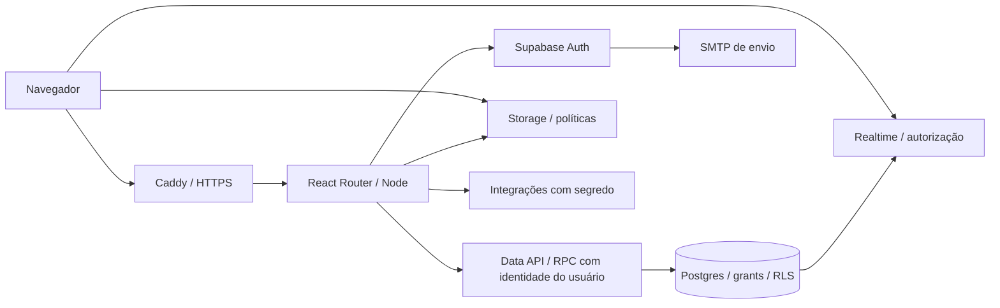

# Especificação — Arquitetura do MVP CircuitoNE

**Estado:** arquitetura aprovada em 22/09/2026; revisada em 06/10/2026 para o PoC. Execução em [plano](../plan.md).

## Objetivo e escopo

Entregar catálogo público de artistas, coletivos e eventos, contas com múltiplas atuações, gestão de coletivos e mensagens. Preservar o design e os componentes úteis do protótipo, com autorização real, páginas públicas acessíveis a buscadores e compartilhamento, e operação em infraestrutura própria para a aplicação.

As [regras de negócio](../business-rules/mvp.md) continuam sendo a fonte canônica do produto. Esta spec substitui as escolhas de SPA exclusiva, roteador próprio e runtime exclusivamente estático da [proposta inicial](../decisions/0001-foundation.md). O [modelo relacional detalhado](../architecture/backend-and-data.md) continua proposto, sujeito ao aceite de cada tarefa e às decisões de produto pendentes.

## Stack aprovada

| Camada | Escolha | Responsabilidade |
|---|---|---|
| Interface | React, TypeScript estrito e Tailwind CSS | Reaproveitar componentes, formulários e estilos do protótipo |
| Rotas e renderização | React Router em Framework Mode, integrado ao Vite | SSR das páginas públicas, navegação interativa, carregamento e ações por rota |
| Backend da aplicação | Node.js, no mesmo projeto do framework | Renderização, orquestração, validação e operações que precisam de segredo |
| Dados | Postgres gerenciado no Supabase | Persistência, constraints, transações, índices, grants e RLS |
| Identidade | Supabase Auth e integração oficial de SSR | Cadastro, confirmação, sessão, recuperação e MFA operacional |
| Arquivos | Supabase Storage | Imagens e documentos com políticas de acesso e limites de upload |
| Atualização de mensagens | Supabase Realtime | Notificar mudanças autorizadas; mensagens permanecem no Postgres |
| Validação de entrada | Zod | Validar contratos nas fronteiras; compartilhar schemas quando útil |
| Testes | Vitest, React Testing Library, Playwright e SQL/pgTAP | Unidade/interação, jornadas e integridade/autorização no banco |
| Execução | Containers Podman, Node e Caddy | Windows agora; Debian próprio posteriormente; HTTPS e proxy reverso |

As versões exatas serão fixadas na migração e verificadas em conjunto. React 19, Tailwind 4 e o toolchain já registrado no repositório são o ponto de partida; nenhuma atualização de dependência é feita por este documento.

## Componentes e fluxo

```mermaid
flowchart LR
  Browser[Navegador] --> Caddy[Caddy / HTTPS]
  Caddy --> App[React Router / Node]
  App --> Auth[Supabase Auth]
  App --> API[Data API / RPC com identidade do usuário]
  API --> DB[(Postgres / grants / RLS)]
  Browser --> Files[Storage / políticas]
  Browser --> RT[Realtime / autorização]
  App --> Files
  App --> External[Integrações com segredo]
  Auth --> SMTP[SMTP de envio]
  DB --> RT
```

Manter um **monólito modular**: contas, perfis, coletivos, eventos, mensagens e administração do site. São módulos do mesmo sistema, sem serviços separados por domínio. O servidor atende loaders/actions e SSR; o cliente mantém estado de interface e usa as integrações necessárias de Auth, Storage e Realtime.

O acesso comum ao banco usa a identidade autenticada do usuário, inclusive no Node, para preservar RLS. Uma chamada direta à API Supabase continua sujeita às mesmas regras: passar pelo servidor não pode ser a única proteção dos dados.

### Responsabilidade das regras

- **React:** interação, feedback e validação para usabilidade. Não decide autorização definitiva.
- **Node:** validação confiável de entradas, sessão, orquestração e integrações externas com segredo. Compartilhar casos de uso entre rotas quando houver reutilização real.
- **Postgres/RPC:** autorização dos dados e invariantes transacionais, como aprovar uma solicitação, criar vínculos e transferir a propriedade única sem deixar coletivo ativo órfão. Preferir constraints e funções pequenas a verificações dispersas.
- **Edge Functions:** somente quando uma operação justificar execução independente. Não criar a mesma regra no Node e em uma Edge Function por padrão.

Usar o SDK Supabase com tipos gerados e migrações SQL em `supabase/migrations/`. Não introduzir ORM, API separada, GraphQL, microserviços, Redis ou filas sem requisito concreto.

Na criação de atuação artística do protótipo, uma quantia única de cachê usa formato brasileiro (`R$ 1.500,00`) e entrada inválida não é convertida em zero. A fronteira de dados converterá a quantia em centavos inteiros e guardará centavos no banco quando a persistência profissional for implementada em F2. Os mocks atuais com faixas de valores não são quantias únicas; a tela de edição ainda não persiste alterações e será alinhada com o contrato em [#15](https://github.com/IgnisDevNE/CircuitoNE/issues/15)/[#20](https://github.com/IgnisDevNE/CircuitoNE/issues/20). A validação no navegador não substitui a validação no servidor.

## Renderização e experiência pública

Páginas públicas de artistas, coletivos e eventos devem entregar conteúdo e metadados relevantes no HTML inicial: título, descrição, URL canônica e informações de compartilhamento. Audiovisual, serviços e integrantes têm perfis somente no catálogo interno autenticado, sem página aberta a visitantes; campos restritos seguem RN-07. Recurso inexistente ou não publicável deve ter resposta HTTP apropriada, sem expor conteúdo restrito. Prerender pode atender páginas estáveis quando fizer sentido.

Painéis e formulários mantêm navegação React interativa. O framework pode renderizar partes dessas telas no servidor, sempre com autorização e isolamento por requisição. Dados pessoais, mensagens e respostas com sessão não entram em cache compartilhado. Cache público só pode conter projeções públicas e precisa respeitar alterações de publicação.

A migração deve preservar links profundos, parâmetros, voltar/avançar, navegação por teclado, estados de carregamento/erro/vazio e recuperação de formulários. Separar acesso a APIs do navegador do código executável no servidor e evitar estado global mutável que misture usuários durante SSR.

## Segurança e identidade

1. Separar dados públicos, profissionais restritos e privados de identidade em estruturas distintas. Nunca enviar campos privados para depois ocultá-los na interface.
2. CPF normalizado e nascimento continuam obrigatórios. Unicidade de CPF deve ser garantida no banco, inclusive sob concorrência; ela não comprova a identidade da pessoa. CPF, tokens e conteúdo de mensagens não devem aparecer em logs.
3. O titular acessa seus próprios contatos e materiais. Ler contatos, presskit, portfólio audiovisual, cachê ou lista de serviços/equipamentos de terceiros exige propriedade atual de coletivo aprovado, conta ativa, e-mail/celular confirmados e MFA (RN-07). Demais membros podem abrir a exploração interna, mas recebem somente projeções não restritas; perfis personalizados não delegam leitura restrita. Os campos por tipo seguem RN-35 (presskit de artista, portfólio audiovisual por link e lista de serviços/equipamentos em PDF privado); coletivos/produtoras não cadastram esses materiais. A criação de coletivo gera estado pendente: dashboard e funções internas ficam bloqueados até a aprovação pela administração do site, conforme RN-30.
4. Administração do site é papel separado da propriedade e dos perfis do coletivo, com provisionamento controlado, MFA e decisões auditadas. Não concede automaticamente leitura de todas as conversas ou dados pessoais. MFA também é obrigatório ao proprietário antes do diretório restrito e da transferência de propriedade.
5. Grants, RLS e políticas de Storage entram junto aos recursos. Testar chamadas diretas, usuários de outro coletivo, remoção de vínculo e IDs manipulados. Não confiar em metadados editáveis pelo usuário para conceder privilégios.
6. Usar a integração oficial Supabase para SSR, clientes isolados por requisição e validação de identidade no servidor; não confiar somente em `getSession()` para autorizar. Tratar refresh, expiração, callbacks permitidos, cookies seguros em produção e proteção contra CSRF nas mutações autenticadas por cookie. Não armazenar sessão exclusivamente na memória de uma instância.
7. Chaves secretas e `service_role` ficam fora do navegador e do bundle. Não usar credencial privilegiada no CRUD comum. Exceções administrativas exigem escopo mínimo, autorização explícita e auditoria; funções SQL privilegiadas também exigem revisão própria.
8. Validar entradas no servidor, limitar abuso no ponto efetivo de operação e proteger Markdown, URLs e uploads. Um limite somente no Caddy não protege uma API Supabase acessível diretamente. Uploads têm tamanho, formato real e autoria verificados; rejeitar conteúdo executável no MVP.
9. Mensagens são persistidas antes de notificar; envios têm idempotência, leitura autorizada e recuperação por cursor após desconexão. Realtime não substitui histórico nem autorização atual.

Supabase Auth cuida das credenciais. Configurar confirmação de e-mail, recuperação, reautenticação sensível e SMTP próprio antes do beta externo. Regras de idade, retenção, recuperação de CPF e demais decisões abertas seguem no documento de negócio; a aprovação da arquitetura não resolve essas pendências.

## Infraestrutura

- **Dev (PoC):** pod Podman único no PC do mantenedor (app Node + Caddy), exposto por Cloudflare Tunnel e Access em `circuitone-dev.magalz.space`, usando o projeto Supabase `CircuitoNE-dev` com seeds sintéticos. Ver [ambiente](../engineering/environment.md).
- **Produção:** `circuitone.magalz.space` serve só a página de espera; o projeto Supabase `CircuitoNE` não tem schema de negócio. Lançamento fora do escopo do PoC.
- **Banco:** migrações em `supabase/migrations/`, testadas em Supabase local descartável no CI e aplicadas no dev pelo workflow `db-dev.yml` após o merge.
- **Escala:** uma instância; réplicas, filas ou cache só diante de necessidade demonstrada.

## Referências técnicas

- [React Router: renderização](https://reactrouter.com/start/framework/rendering).
- [Supabase: segurança da API](https://supabase.com/docs/guides/api/securing-your-api) e [Auth com SSR](https://supabase.com/docs/guides/auth/server-side/advanced-guide).
